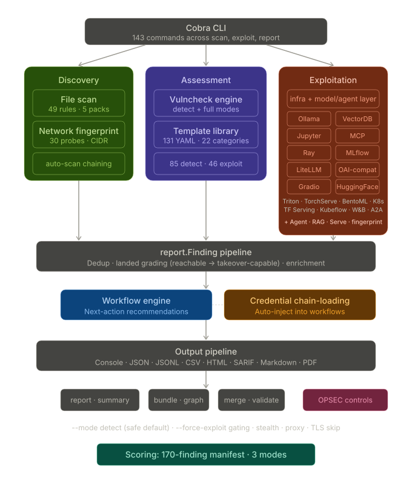

# aipostex

**AI Infrastructure Offensive Security Framework**

[](https://github.com/professor-moody/aipostex/actions/workflows/ci.yml)
[](https://go.dev)
[](https://github.com/professor-moody/aipostex-templates)
[](#exploit-modules)
[](LICENSE)

A single-binary Go tool for discovering, assessing, and exploiting AI/ML infrastructure. Purpose-built for penetration testers, red teams, and adversary emulation operators targeting LLM gateways, model registries, inference servers, vector databases, Jupyter notebooks, and MCP tool servers.

> **Documentation:** [professor-moody.github.io/aipostex](https://professor-moody.github.io/aipostex/)
>
> **Community Templates:** [aipostex-templates](https://github.com/professor-moody/aipostex-templates)
>
> **Lab Environment:** [aipostex-lab](https://github.com/professor-moody/aipostex-lab)

---

## Architecture



Discovery, assessment, exploitation, and the by-hand [operator console](https://professor-moody.github.io/aipostex/cli/request/)
all feed one honest finding pipeline — every finding graded by what actually landed. The
**[full documentation](https://professor-moody.github.io/aipostex/)** is the source of truth; this
README is a summary.

---

## Quick Start

```bash
# Install from source
go install github.com/professor-moody/aipostex/cmd/aipostex@latest

# Or build from repo
git clone https://github.com/professor-moody/aipostex.git
cd aipostex && make build

# Discover AI services on a network
aipostex discover network --target 10.0.0.0/24

# Scan a discovered target with vulnerability templates
aipostex scan targets --target http://10.0.0.50:11434

# Full assessment — discovery + scanning + exploitation
aipostex assess network --target 10.0.0.0/24 --mode full
```

## Three-Command Demo

```bash
# 1. What's out there?
aipostex discover network --target 172.16.50.0/24

# 2. Extract system prompts from every loaded model
aipostex ollama --target http://ollama:11434 prompts

# 3. Enumerate an MCP server and run the credential-exfil kill chain
aipostex mcp --target http://mcp:3000 chain --force-exploit
```

### Run an engagement: scan, and the dossier builds itself

Open a session and every command auto-accumulates into one engagement dossier — no per-command
`--output` flags:

```bash
aipostex sessions start acme            # -> ~/engagements/acme
aipostex discover network --target 10.0.0.0/24
aipostex ray --target http://10.0.0.20:8265 jobs
aipostex mlflow --target http://10.0.0.30:5000 --header "Authorization: Basic <looted>" runs
aipostex report view ~/engagements/acme --chains --commands   # find → loot → chain → reached
aipostex sessions stop
```

See [sessions](https://professor-moody.github.io/aipostex/cli/sessions/).

---

## Capability Summary

### Discovery

| Capability | Description |
|---|---|
| Network Discovery | CIDR scanning with 30 HTTP probes across 20+ AI service families |
| File Discovery | 49 rules for API keys, model files, MCP configs, RAG pipelines, training data |
| Fingerprinting | Service identification and version extraction |

### Scanning

| Capability | Description |
|---|---|
| Detection Templates | 85 YAML templates for misconfigurations, auth bypass, metadata exposure |
| Exploit Templates | 46 YAML templates proving impact (gated behind `--mode full`) |
| Advisory Checks | 24 CVE-specific templates plus 2 GHSA and 1 TRA templates across Ollama, MCP, Gradio, MLflow, Ray, vLLM, LangChain |
| Credential Chain-Loading | Discovered credentials auto-injected into follow-up assessment steps |

### Exploit Modules

| Module | Capabilities |
|---|---|
| **Ollama** | Model enum, system prompt extraction, compute abuse, capped model weight blob exfiltration |
| **Jupyter** | Notebook listing, content reading, **cell secret mining**, kernel exec, reverse-shell proof, pip proof |
| **MCP** | Config analysis/hijack, tool enumeration, schema poisoning, env extraction, credential chain, streamable-HTTP SSE |
| **OpenAI-Compatible** | Auth sweep, LiteLLM probe, prompt injection testing, tool injection, behavioral model fingerprint (identity/contradiction/cutoff) |
| **LiteLLM** | Config extraction, budget/spend probe, proxy chain analysis, credential discovery |
| **MLflow** | Experiment/run enum, **param/tag secret extraction**, artifact download, capped bulk artifact exfiltration, registry mutation proof, controller-confirmed hook metadata |
| **Ray** | Cluster enum, job submission, log exposure, pip injection, cluster resource exfiltration |
| **Gradio** | Config exposure, API surface enum, file read/upload/download, queue-backed execution |
| **Vector DBs** | ChromaDB, Weaviate, Qdrant, Milvus, pgvector — enum, search, inject |
| **BentoML** | OpenAPI route discovery, schema-shaped predict guidance, input-dependent inference verification, metrics exposure |
| **Triton** | Model repo access, post-load inference verification, shared memory exposure, inference abuse |
| **TorchServe** | Management API access, model registration, SSRF via model URL, registered-handler execution verification |
| **HuggingFace TGI/TEI** | Auto-detect TGI vs TEI, model enum, metrics, bounded model file download, text generation, embedding |
| **TF Serving** | Model discovery, metadata/signature extraction, signature-shaped predict guidance, Prometheus metrics, input-dependent inference verification |
| **Kubeflow** | Pipeline/run/experiment enum, notebook listing, pipeline run submission |
| **W&B** | Project enum, run metadata extraction, artifact discovery |
| **A2A** | Agent card enum, skill discovery, task injection, push-notification hijack, rogue-agent registration |
| **Kubernetes** | Anonymous RBAC probe, identity access-review, workload/CRD enum, Secret exfiltration, model-artifact harvest, in-pod exec, in-cluster lateral movement (SA-token theft + escalation) |
| **Agent** (bespoke `/chat`) | Configurable-transport probe/enum, system-prompt extraction with an output-filter-bypass matrix, behavioral model fingerprint, direct prompt injection with an input-filter-bypass matrix, defensive-posture (guardrail) profile |
| **RAG** (black-box) | Citation recon via `/query`, knowledge-base mapping, ingestion poisoning with obey-marker indirect-prompt-injection confirmation |

### Operator Console

Interact with any service **by hand**, authenticated or unauthenticated — the operator drives every
request and turn (no automated chaining). Responses are captured into the loot index.

| Command | Description |
|---|---|
| `request` | Issue a single arbitrary HTTP operation through the tool. Top-level `aipostex request METHOD PATH-OR-URL`, plus a per-module verb (`mlflow`, `ray`, `ollama`, `openai-compat`, `litellm`, `vectordb`, `huggingface`). |
| `shell` | Interactive REPL against a service: LLM chat (Ollama/OpenAI-compat/LiteLLM/HF), Jupyter kernel, MCP tool-caller, A2A task console. |

See the [console reference](https://professor-moody.github.io/aipostex/cli/request/).

### Operator Controls

| Feature | Description |
|---|---|
| Safety Gating | `--force-exploit` for mutating actions, `--mode full` for exploit templates |
| OPSEC | User-Agent rotation, TLS fingerprint randomization, jitter, proxy support |
| Output Formats | JSON, JSONL, CSV, Markdown, HTML, SARIF, PDF |
| Landed / Stage | Every finding tagged with a `landed` value (`reachable` → `influenced` → `read-confirmed` → `execution-confirmed` → `takeover-capable`) and a kill-chain `stage` (`recon` → `access` → `impact` → `own`) |
| Report Generation | `report render`, `report summary`, `report graph`, `engagement bundle` |
| Model Scanning | `model-scan` for pickle/PyTorch deserialization risk in local model files |
| MCP Server | `serve` exposes the read-only verbs (+ a confirm-gated `rag_poison`) as MCP tools over stdio so an LLM/agent can drive the tool |

---

## Build & Test

```bash
make build          # bin/aipostex (static, CGO_ENABLED=0)
make build-all      # Cross-compile (linux, darwin, windows x amd64, arm64)
make test           # Tests with race detector
make lint           # golangci-lint v2
```

Requires **Go 1.25+**.

To verify a module against the **real product** (not a mock), use the lab's single-service sandbox —
see [Testing Against Real Products](https://professor-moody.github.io/aipostex/development/sandbox/).

## Project Structure

```
cmd/aipostex/         CLI commands (Cobra)
pkg/discover/         Network and file discovery engine
pkg/fingerprint/      Service fingerprinting probes
pkg/vulncheck/        YAML template engine and 131 embedded templates
pkg/exploit/          Exploit modules (ollama, jupyter, mcp, mlflow, ray, ...)
pkg/report/           Finding schema and output formatting
internal/             Assessment orchestration, config, credential chain-loading
docs/                 MkDocs documentation site
```

## Links

- [Documentation](https://professor-moody.github.io/aipostex/)
- [Community Templates](https://github.com/professor-moody/aipostex-templates)
- [Lab Environment](https://github.com/professor-moody/aipostex-lab)
- [Changelog](CHANGELOG.md)

## Authorized use

aipostex is built for authorized security testing, red-team engagements, and research. Only run it
against systems you own or have explicit written permission to test. You are responsible for
complying with all applicable laws. See [SECURITY.md](SECURITY.md) to report a vulnerability in the
tool itself.

## License

See [LICENSE](LICENSE) for details.
