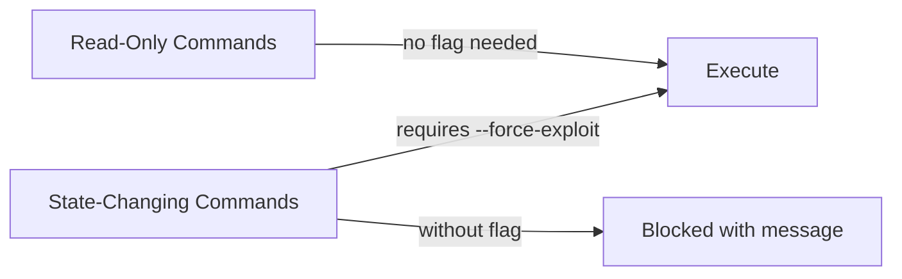
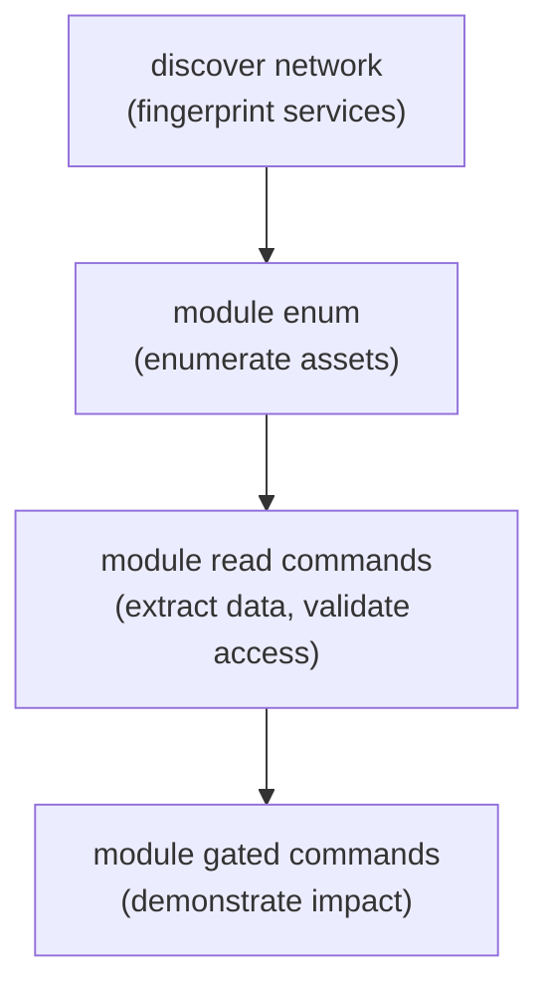

# Exploit Modules

aipostex includes 20 post-exploitation modules, each targeting a specific AI service family. Modules follow a consistent pattern: read-only enumeration commands run without restrictions, while state-changing or high-noise actions require `--force-exploit`.

## Module Summary

| Module | Service(s) | Subcommands | Read-Only | Gated |
|---|---|---|---|---|
| [ollama](ollama.md) | Ollama | 10 | 5 | 5 |
| [vectordb](vectordb.md) | ChromaDB, Weaviate, Qdrant, Milvus, pgvector | 5 | 3 | 2 |
| [jupyter](jupyter.md) | Jupyter Notebook | 8 | 4 | 4 |
| [mcp](mcp.md) | MCP servers | 8 | 3 | 5 |
| [openai-compat](openai-compat.md) | OpenAI-compatible APIs | 10 | 8 | 2 |
| [ray](ray.md) | Ray | 9 | 4 | 5 |
| [mlflow](mlflow.md) | MLflow | 12 | 8 | 4 |
| [gradio](gradio.md) | Gradio | 7 | 4 | 3 |
| [bentoml](bentoml.md) | BentoML | 4 | 3 | 1 |
| [triton](triton.md) | NVIDIA Triton Inference Server | 7 | 4 | 3 |
| [torchserve](torchserve.md) | PyTorch TorchServe | 7 | 3 | 4 |
| [litellm](litellm.md) | LiteLLM Proxy | 5 | 4 | 1 |
| [huggingface](huggingface.md) | HuggingFace TGI/TEI | 6 | 3 | 3 |
| [tfserving](tfserving.md) | TensorFlow Serving | 5 | 4 | 1 |
| [kubeflow](kubeflow.md) | Kubeflow Pipelines | 6 | 5 | 1 |
| [wandb](wandb.md) | Weights & Biases | 5 | 5 | 0 |
| [a2a](a2a.md) | Agent-to-Agent APIs | 12 | 4 | 8 |
| [k8s](k8s.md) | Kubernetes API server (ML/AI workloads) | 7 | 3 | 4 |
| [agent](agent.md) | Bespoke LLM `/chat` apps | 6 | 6 | 0 |
| [rag](rag.md) | Black-box RAG apps | 3 | 2 | 1 |

## Utilities

| Command | Purpose | Doc |
|---------|---------|-----|
| `model-scan` | Local model file supply-chain scan (pickle / PyTorch / formats) | [model-scan](model-scan.md) |

These modules provide the main post-exploitation surface of the tool, covering read-only enumeration through gated proof actions.

## Common Flags

All exploit modules share these flags:

| Flag | Description |
|---|---|
| `--target` | Target service URL (required for all remote commands). |
| `--header` | Custom HTTP header(s) in `Key: Value` format. Repeatable. |

## Safety Model

Read-only commands include: enumeration, listing, reading, extraction, fingerprinting, and passive analysis.

Gated commands include: model creation/deletion/poisoning, code execution, file uploads, throughput/proxy testing, and queue/serve probes.

See [Safety Model](../operator-guide/safety.md) for the complete gated action reference.

## Operator Progression

Each module supports a progression from enumeration to proof:

Findings from earlier stages attach workflow recommendations pointing to the next logical command, using values discovered in the current step (model names, collection IDs, kernel IDs, job IDs, etc.).

## Operator Console

Alongside the module verbs, the operator console lets you keep interacting with a reached service **by hand** — authenticated or unauthenticated — at any stage, driving every request yourself (no automated chaining). Two commands: [`request`](../cli/request.md), a one-shot arbitrary HTTP call captured and mined for loot, and [`shell`](../cli/shell.md), an interactive REPL. Which modules expose which:

| Console verb | Modules |
|---|---|
| [`request`](../cli/request.md) (one-shot HTTP) | `ollama`, `mlflow`, `ray`, `openai-compat`, `litellm`, `vectordb`, `huggingface` — plus the top-level `aipostex request` for any HTTP service |
| [`shell`](../cli/shell.md) (interactive REPL) | `ollama`/`openai-compat`/`litellm`/`huggingface` (LLM chat), `jupyter` (kernel Python), `mcp` (tool-caller), `a2a` (task console) |

The execution shells (`jupyter`/`mcp`/`a2a`) require `--force-exploit`; LLM chat is ungated. Kubernetes has no in-tool console — its interactive channel is `kubectl`, handed off as a kubeconfig by the [dossier](../cli/report-view.md)'s `manual/` folder.
