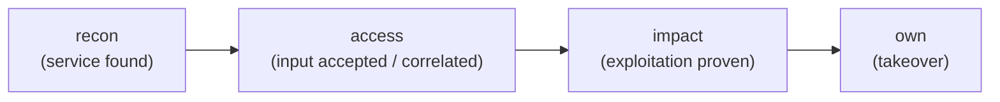

# Workflow Metadata

Findings from discovery, enumeration, and scan commands carry structured workflow metadata that suggests concrete next steps. This metadata is preserved in JSON/JSONL output and rendered as `next:` lines in console output.

## metadata.workflow

The `workflow` key in finding metadata contains a structured plan:

```json
{
  "metadata": {
    "workflow": {
      "target": "http://10.0.0.5:11434",
      "stage": "recon",
      "rationale": "Ollama service discovered via fingerprint",
      "landed": "reachable",
      "chain_source": "discover network",
      "recommendations": [
        {
          "command": "aipostex ollama --target http://10.0.0.5:11434 enum",
          "rationale": "Enumerate models and version",
          "gated": false,
          "priority": 10,
          "stage": "access"
        },
        {
          "command": "aipostex ollama --target http://10.0.0.5:11434 poison --base-model llama3 --new-model llama3-backdoor --system-prompt \"...\" --force-exploit",
          "rationale": "Demonstrate model tampering",
          "gated": true,
          "priority": 50,
          "stage": "own"
        }
      ]
    }
  }
}
```

### Workflow Fields

| Field | Description |
|---|---|
| `target` | The target URL for follow-on commands |
| `stage` | Kill-chain phase this plan targets (`recon`/`access`/`impact`/`own`) — same vocabulary as finding `metadata.stage` |
| `rationale` | Why this finding triggered workflow generation |
| `landed` | What actually landed on the target (see Landed Levels below) |
| `chain_source` | What produced this finding (e.g., `discover network`, `enum`) |
| `recommendations` | Ordered list of suggested next commands |

### Recommendation Fields

| Field | Description |
|---|---|
| `command` | The exact `aipostex` command to run |
| `rationale` | Why this step is useful |
| `gated` | Whether the command requires `--force-exploit` |
| `priority` | Ordering priority (lower = run first) |
| `stage` | Kill-chain phase this command advances toward (`recon`/`access`/`impact`/`own`) |

### Ordering

Recommendations are ordered by priority (ascending). Read-only commands always appear before gated commands, regardless of priority value.

When the originating fingerprint is `suspected` or `ambiguous`, workflow generation becomes more conservative:

- a broad `scan targets --target <url>` command is prepended before module-specific follow-ons
- module-specific recommendations keep read-only paths only
- gated recommendations are suppressed until the service identity is confirmed

## metadata.evidence

The `evidence` key contains display-safe evidence metadata:

```json
{
  "metadata": {
    "evidence": {
      "preview": "3 models: llama3, mistral, codellama",
      "raw_length": 2048,
      "artifact_kind": "model-list",
      "sensitivity_hints": ["model-names"]
    }
  }
}
```

| Field | Description |
|---|---|
| `preview` | Truncated, display-safe evidence string |
| `raw_length` | Length of the full raw evidence |
| `artifact_kind` | Classification of the evidence artifact |
| `sensitivity_hints` | Tags indicating sensitivity level |

Console output uses the `preview` string. JSON/JSONL output preserves the full raw evidence in the top-level `evidence` field.

## Workflow Stage Progression

The workflow plan's `stage` field uses the **same kill-chain vocabulary as finding
`metadata.stage`** (`recon → access → impact → own`) — it marks the phase each suggested
next command advances toward, so the two "stage" axes never disagree:



| Stage | Description | Example |
|---|---|---|
| `recon` | Service or artifact found; enumeration | `discover network` fingerprint, `enum` lists models/collections/tools |
| `access` | Input accepted / assets correlated / credentials swept | `config-extract`, credential correlation |
| `impact` | Read/exploitation validated | `extract`, `prompts`, `read-notebook` |
| `own` | State-changing takeover | `poison`, `exec`, `submit` |

## Landed Levels

| Landed | Meaning |
|---|---|
| `reachable` | Service responds to probes |
| `influenced` | Behavior was observably influenced |
| `read-confirmed` | Data was successfully read |
| `execution-confirmed` | Code or commands executed |
| `takeover-capable` | Full control demonstrated |

## Console Rendering

In console output, workflow recommendations appear as `next:` lines:

```
 INFO  [fingerprint] AI service suspected: ollama
  target: http://10.0.0.5:11434
  context: service=ollama  port=11434  match_kind=suspected  confidence=medium  specificity=90
  next: [read] aipostex scan targets --target http://10.0.0.5:11434
  next: [read] aipostex ollama --target http://10.0.0.5:11434 enum
```

The `[read]` prefix indicates a read-only command. The `[gated]` prefix indicates a command requiring `--force-exploit`.

## Using Workflow Metadata Programmatically

Extract next commands from JSONL output:

```bash
# Get all recommended commands
cat findings.jsonl | jq -r '.metadata.workflow.recommendations[]?.command'

# Get only read-only commands
cat findings.jsonl | jq -r '.metadata.workflow.recommendations[] | select(.gated == false) | .command'

# Get commands for a specific target
cat findings.jsonl | jq -r 'select(.target == "http://10.0.0.5:11434") | .metadata.workflow.recommendations[]?.command'
```
